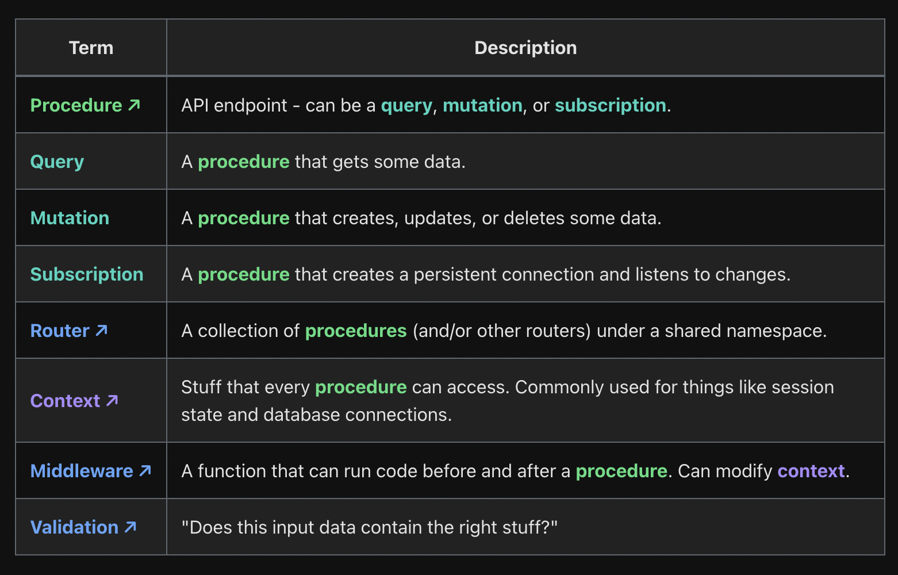

# Next trpc learn

## What is RPC? What mindset should I adopt?

RPC is short for "Remote Procedure Call".

## Terms

## Diagram

https://www.c-ehrlich.dev/img/youtube/trpc-data-flows.png

## Examples

T3 stack: https://github.com/jherr/notetaker

Nextjs setup: https://trpc.io/docs/nextjs/setup
